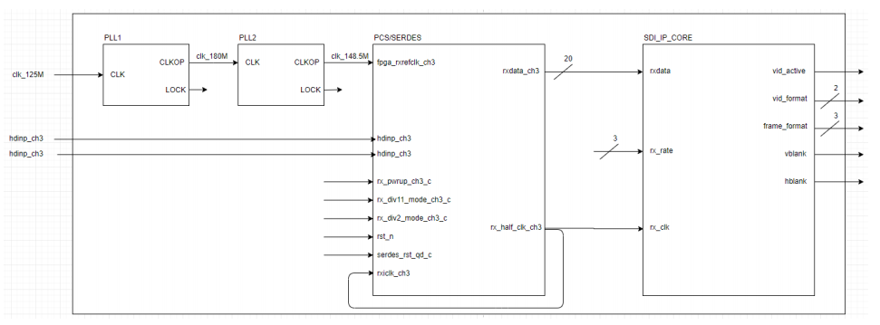

# FPGA ANALYSE

Travail en cours :

Premiers essais d'analyse d'un flux vidéo SDI.
Le projet est en développement sur la branche **test_SDI_IP**

## Entrées / Sorties

Sorties|Description
--------|----------
vid_active|
vid_format| Sur 2 bits
frame_format| Sur 3 bits
vblank|
hblank|

## Trames et registres

### Trames SDI

Cette trame représente les informations transmises au STM32 après l'analyse.

Octet| Nom |Valeur| Description
-----|-----|------|--------------
1| Nb_Octets| 0x9 |Nombre d’octet de la trame
2| ID_Sys| 0x3| Système dont la commande est sollicitée
3| ID_Cmd| 0x1| SDI_INFO
4| Vid_format| 2 bits| Se compose de 2 bits, il permet d’afficher la résolution (voir tableau ci-dessous)
6| Frame_format| 3 bits| Se compose de 3 bits, il permet d’afficher le frame format (voir tableau ci-dessous)
7| Vid_active| 1 bit| Une info d’un bit qui indique qu’une ligne du frame est transmise.
8| vblank| 1 bit| Une info d’un bit, si égal 1 en reçoit un flux sinon on ne reçoit rien
9| hblank| 1 bit |Un signal d’un bit est transmis après le transfert de la frame entière

